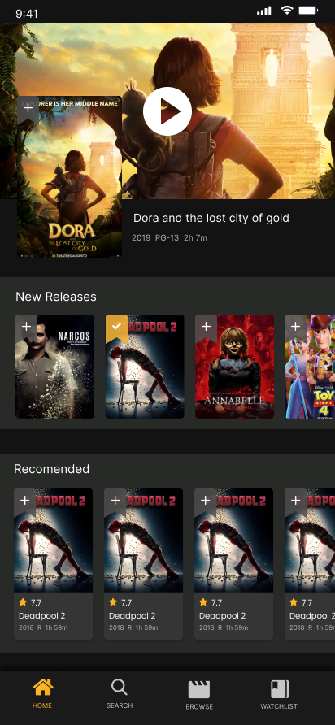
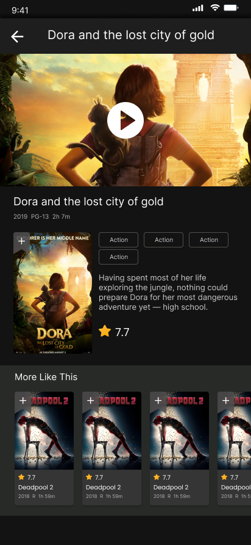
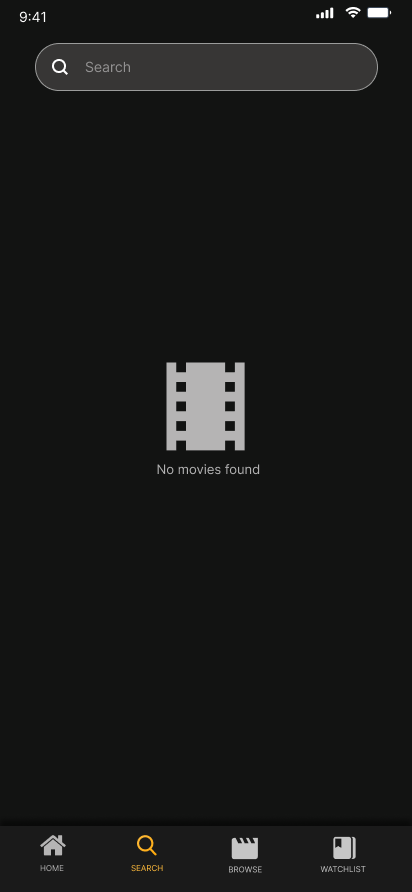
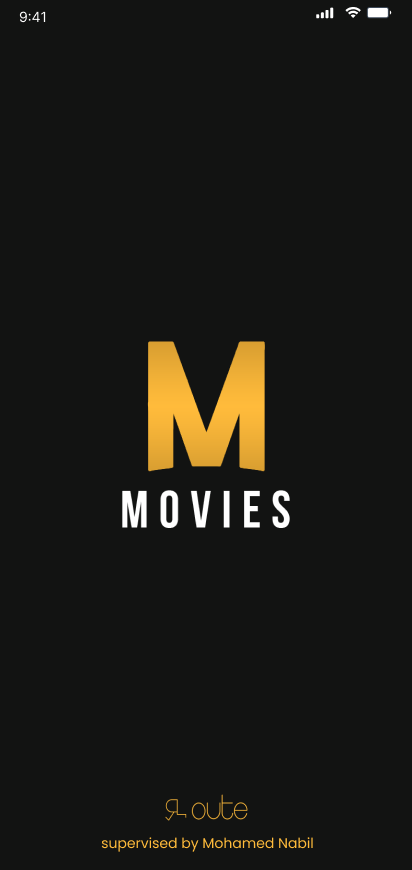
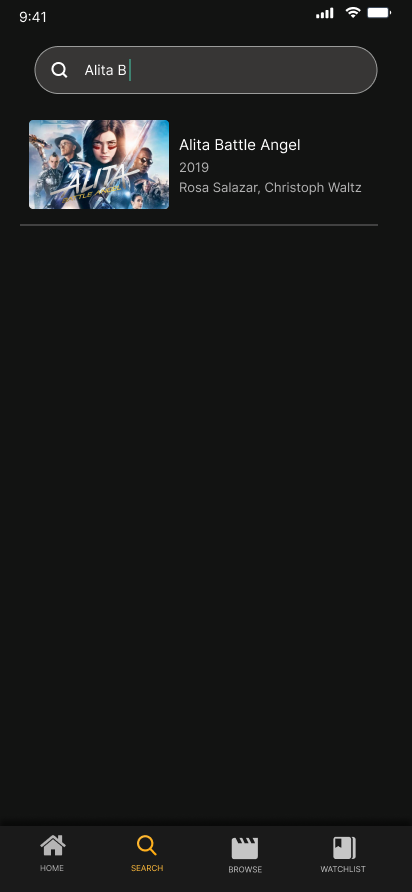
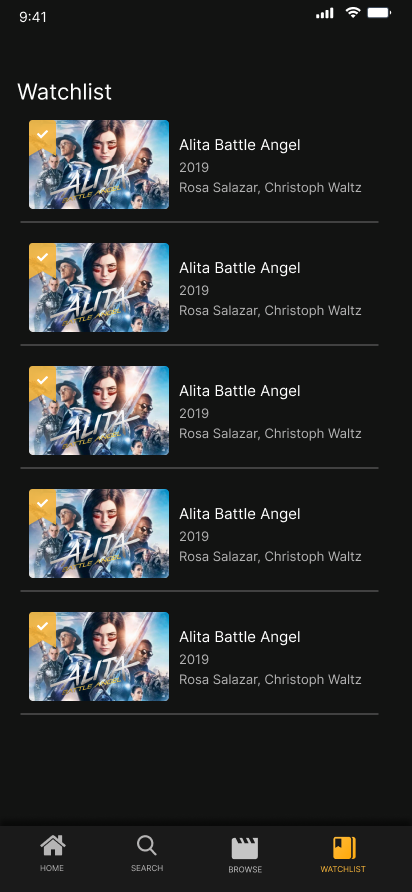

# Movies App

## 📑 Table of Contents
1. [🚀 Introduction](#-introduction)
2. [🛠 Installation & Setup](#-installation--setup)
3. [🤝 Contribution Guide](#-contribution-guide)
4. [🖥️ Technical Stack](#️-technical-stack)
5. [🎥 Demo Video](#-demo-video)
6. [🛠 Features](#-features)
7. [📷 Screenshots](#-screenshots)
8. [👥 Contributors](#-contributors)

## 🚀 Introduction
The Movies App is a beautifully designed platform for browsing and discovering movies. With an intuitive user interface, users can view trending movies, explore details, and manage a personalized watchlist.

## 🛠 Installation & Setup
To run this project locally, follow these steps:

### Prerequisites
- **Flutter SDK**: Ensure you have the Flutter SDK installed. [Download Flutter](https://flutter.dev/docs/get-started/install)
- **IDE**: Use an IDE like Android Studio, VS Code, or IntelliJ IDEA with Flutter and Dart plugins installed.
- **Device/Emulator**: A physical device or emulator to run the app.

### Steps
1. Clone the repository:
   ```bash
   git clone [https://github.com/username/movies_app.git](https://github.com/MoatazAbdElwhab/movies.git)
   cd movies_app
   ```

2. Install dependencies:
   ```bash
   flutter pub get
   ```

3. Run the app:
   ```bash
   flutter run
   ```

## 🤝 Contribution Guide
We welcome contributions from the community! To contribute:

1. Fork the repository.
2. Create a new branch for your feature:
   ```bash
   git checkout -b feature-name
   ```
3. Make your changes and commit:
   ```bash
   git commit -m "Add a detailed commit message"
   ```
4. Push the branch:
   ```bash
   git push origin feature-name
   ```
5. Open a Pull Request.

## 🖥️ Technical Stack
This project is built using the following technologies and follows the MVVM architecture for efficient code organization and separation of concerns:

### **Core Technologies**
- **Flutter**: The main framework used for building the app.
- **Dart**: The programming language powering Flutter.

### **UI & UX**
- **cached_network_image**: For caching and displaying images efficiently.
- **carousel_slider**: To create image sliders for movie carousels.
- **flutter_screenutil**: For responsive UI design across different screen sizes.
- **google_fonts**: To customize fonts for a modern and clean design.
- **flutter_native_splash**: To add a custom splash screen for better branding.
- **font_awesome_flutter**: For using a variety of vector icons in the app.

### **State Management**
- **provider**: To implement MVVM architecture and manage state efficiently.

### **Networking & Backend**
- **http**: For making API calls to fetch movie data.
- **cloud_firestore**: To integrate with Firebase Firestore for managing data in the cloud.
- **firebase_core**: Core Firebase functionalities for the app.

### **Development Tools**
- **device_preview**: To preview and test the app on different devices.
- **cupertino_icons**: Provides iOS-style icons for a consistent cross-platform experience.

## 🎥 Demo Video
Watch the demo video to see the application in action:
**[Demo Video Link](https://drive.google.com/file/d/1zQ1obTvWfSa_Ozw4Tgppof-D9b-VMKiN/view?usp=drive_link)**


## 🛠 Features
### 🎥 Movie Discovery
- View popular and trending movies.
- Explore new releases and recommended titles.
- See movie ratings and runtime.

### 🔍 Search & Navigation
- Search for movies using keywords.
- Navigate between Home, Search, Browse, and Watchlist using a bottom navigation bar.

### 📝 Watchlist
- Add movies to a personal watchlist.
- Remove movies from the watchlist.
- View all saved movies in one place.

### 💫 User-Friendly Interface
- Clean and modern design.
- Easy navigation between screens.
- Responsive layout for all devices.

## 📷 Screenshots
| Home | Movie Details | Search |
|------------------------------|------------------------------|-----------------------------|
|  |  |  |

| Splash | Search 2 | WatchList                                                |
|------------------------------|------------------------------|----------------------------------------------------------|
|  |  |  |

## 👥 Contributors
- **Mohammed Hussein** ([Mohammedhussein12](https://github.com/Mohammedhussein12))
- **Moataz Abd El wahab** ([MoatazAbdElwahab](https://github.com/MoatazAbdElwhab))
- **Ahmed Safwat** ([ASHmd97](https://github.com/ASHmd97))
- **Ola Saleh** ([Olasaleh2000](https://github.com/Olasaleh2000))

